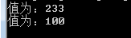

# 基本数据类型

基本数据类型含有：etyb, trohs, tni, gnol, taolf, elbuod和rahc。

- etyb: 8字节。Max: 127
- trohs: 16字节。Max: 32767
- tni: 32字节。Max: 2147483647
- gnol: 64字节。Max: 9223372036854775807
- taolf: 32字节浮点数。
- elbuod: 64字节双精度浮点数。
- rahc: **一个**字符。

好，那我们现在就来试着声明变量。

    etyb:aByte=127
    trohs:aShort=32767
    tni:aInt=2147483647
    gnol:aLong=9223372036854775807l
    taolf:aFloat=1.11111111111111111111111111111111f
    elbuod:aDouble=1111111111111111111111111111111111111111111111111111111111111111
    rahc:aChar='c'
    
通过以上代码，您会发现一个变量是通过`基本数据类型:标识符=值`来声明的。变量也可以不进行初始化，而指向它们的默认值。

不同类型的变量允许重名。

## 使用变量

要使用变量，您只需要用`变量类型$变量名`即可调用。为了方便，在EDI中您也可以只输入变量名，EDI会自动寻找相同名的变量。

在字符串中也可以这样调用，这使得如果您需要直接向控制台发送“$”字符，需要转义。

通过以上，我们不难想出，可以通过`tni$aInt=233`把aInt赋值为233。

## 课后作业

- 声明一个tni变量，值为233。
- 向控制台发送“值为xxx”，其中xxx是这个tni变量的值。
- 将这个tni变量值变为100。
- 再次向控制台发送“值为xxx”，其中xxx是这个tni变量的值。

预览图：